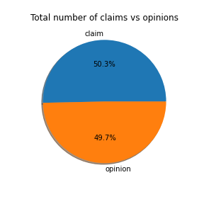
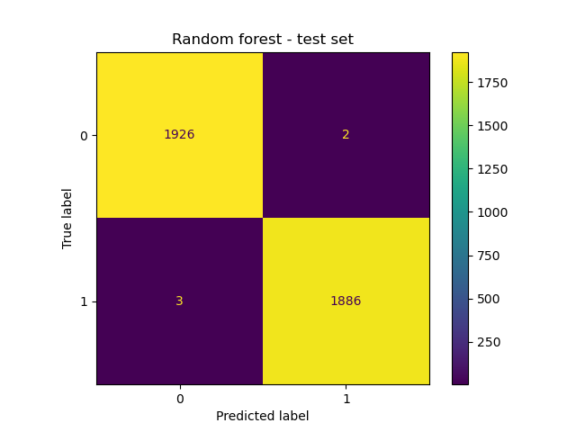
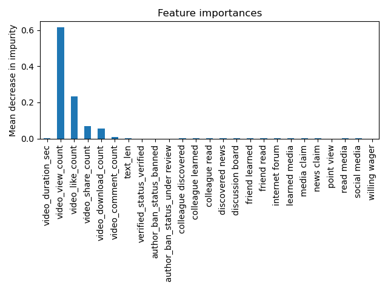

# TikTok Video Claims Classification
Developing a predictive model to classify TikTok videos as claim or opinion using exploratory data analysis and machine learning.

Note: This project is a part of *Google Advanced Data Analytics Professional Certificate Course*.

# Project Overview
In this project, we develop a claims classification model for TikTok videos. More specifically, the goal is to build a machine learning model that can be used to determine whether a video contains a claim or whether it offers an opinion. We use a synthetic dataset from TikTok and organize the raw dataset for further analysis. Thorugh exploratory data analysis (EDA), we explored, analyzed, cleaned, and structured data to gain insights into user engagement levels. Afterwards, we utilized statistical techniques, such as hypothesis tests, to determine relationships among variables and used regression analysis, such as logistic regression, to model user behaviors. Finally, we constructed classification models to predict the status of claims made by the users. 

The order of notebooks to follow:
- TikTok project lab - Intro.ipynb
- TikTok project lab - EDA.ipynb
- TikTok project lab - Statistical Analysis.ipynb
- TikTok project lab - Regression Analysis.ipynb
- TikTok project lab - ML.ipynb

# Business Understanding 
TikTok videos receive a large number of user reports for many different reasons. Not all reported videos can undergo review by a human moderator. Videos that make claims (as opposed to opinions) are much more likely to contain content that violates the platform’s terms of service. TikTok seeks a way to identify videos that make claims to prioritize them for review. The development of a predictive model that can determine whether a video contains a claim or offers an opinion can reduce the backlog of user reports and prioritize them more efficiently.

# Data Understanding 
This project uses a dataset containing synthetic data created by TikTok. The dataset contains 12 columns and 19,382 rows, each row representing a different published TikTok video in which a claim/opinion has been made. In the dataset, in total 298 rows contained missing/null values and no duplicated rows. Since the number of rows containing null values is trivial, we removed these rows before futher processing. The dataset is balanced containing almost equal number of claim and opinion vidoes. 
Categorical variables such as `claim_status`, `verified_status`, and `author_ban_status` are encoded to numerical values, where as `video_id` and `#` columns are dropped before the predictive analysis. Since the feature `video_transcripted_text` is text-based, a new feature named `text_length` is extracted through feature engineering process. Moreover, *bag-of-words* algorithm  is used to generate numerical features. More specifically, each video's transcription text is tokenized into both 2-grams and 3-grams, then the 15 most frequently occurring tokens are used as features.

# Modeling and Evaluation 
We built two tree-based classification models, XGBoost and Random Forest. Both models were used to predict on a held-out validation dataset, and final model selection was determined by the model with the best score. 

Since, identifying claims was the priority, so it's important that the model be good at capturing all actual claim videos. Therefore, in a given scenario, it's better for the model to predict *false positives* when it makes a mistake, and worse for it to predict *false negatives*. The worst case for an opinion misclassified as a claim is that the video goes to human review. The worst case for a claim that's misclassified as an opinion is that the video does not get reviewed and it violates the terms of service. Hence, we use *recall* score as the model evaluation metric because it's more important to minimize *false negatives*.

Both XGBoost and Random Forest achieved near perfect scores in terms of accuracy, recall, presicion, and f1-score. However, investigating the confusion matrices, we found that XGBoost produces 21 false negatives compared to Random Forest's 5 false negatives. Therefore, Random Forest model performed slightly better than XGBoost model.

We select Random Forest as the final model and applied it to a test dataset to estimate future performance. The result shows that out of 3817 data instances, the model produces only 2 false positives and 3 false negatives.
The most predictive features are the count variables, which represent high engagement levels. This is not unexpected, as analysis from our prior EDA pointed to this conclusion.

 

# Conclusion
The developed predictive models performed exceptionally well on the test holdout data. The primary predictors were all related to video engagement levels, with video view count, like count, share count, and download count accounting for nearly all predictive signal in the data. With these results, we can conclude that videos with higher user engagement levels were much more likely to be claims. Therefore, it is recommended to monitor the distributions of video engagement levels to ensure that the model remains robust to fluctuations in its most predictive features.
